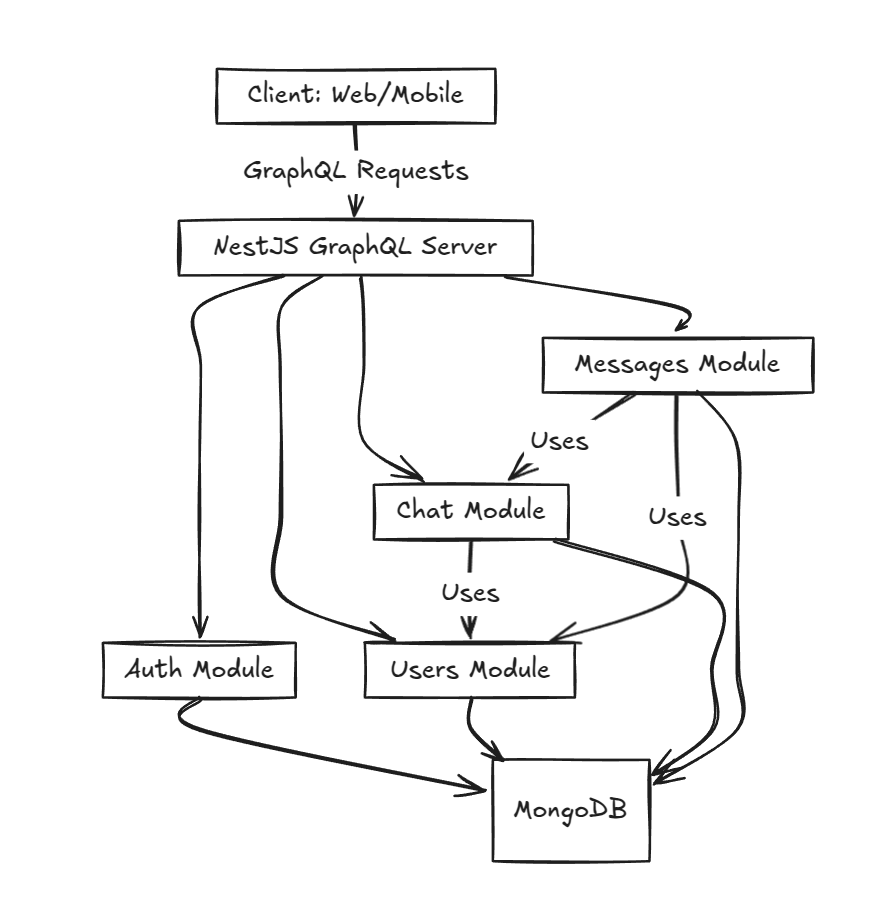

# Niv Chat Backend

A real-time chat backend built with [NestJS](https://nestjs.com/), [GraphQL](https://graphql.org/), and [MongoDB](https://www.mongodb.com/) (using Mongoose). It supports one-to-one and group chats, JWT authentication, message management, and efficient pagination.

## Features

- **Real-Time Chat:** One-to-one & group chat functionality.
- **GraphQL API:** Code-first approach with queries and mutations.
- **Authentication:** Secure endpoints using JWT and Passport.
- **Message Handling:** Create, update, and delete messages with last message tracking.
- **Pagination:** Efficient pagination for chats and messages.
- **Modular Architecture:** Organized into Users, Chats, and Messages modules.

## Tech Stack

- **Backend:** NestJS
- **API:** GraphQL
- **Database:** MongoDB with Mongoose
- **Auth:** Passport.js with JWT
- **Language:** TypeScript

## High-Level Architecture

The system is divided into several modules that interact with each other. The diagram below illustrates the overall architecture:



- **Client:** Web or mobile applications send GraphQL requests.
- **Server:** NestJS GraphQL server handles requests through its Auth, Users, Chats, and Messages modules.
- **Database:** MongoDB stores all the data.

## Data Model (ER Diagram)

The core entities in this project are **User**, **Chat**, and **Message**. Their relationships are illustrated below:


- **User:** Represents an individual using the chat app.
- **Chat:** Represents a conversation. It contains an array of user references and a reference to the latest message.
- **Message:** Represents an individual message within a chat, linked to both a chat and the sender.

## Sequence Diagram: Message Flow

The following diagram shows the sequence of events when a user sends a message:


1. **User** sends a message via a GraphQL mutation.
2. **Message Resolver** passes the request to the **MessageService**.
3. **MessageService** creates a new message through the **MessageRepository**.
4. After creation, **MessageService** calls **ChatService** to update the chat's lastMessage field via **ChatRepository**.
5. The updated message and chat data are returned to the client.

## Installation

1. **Clone the repository:**

   ```bash
   git clone https://github.com/yourusername/niv-chat-backend.git
   cd niv-chat-backend
   ```

2. **Install dependencies:**

   ```bash
   npm install
   ```

   or with pnpm:

   ```bash
   pnpm install
   ```

3. **Set up environment variables:**  
   Create a `.env` file in the project root and add:

   ```env
   PORT=3000
   MONGODB_URI=mongodb://localhost:27017/nivchat
   JWT_SECRET=your_jwt_secret_key
   NODE_ENV=development
   ```

4. **Run the application:**
   ```bash
   npm run start:dev
   ```

## Usage

### GraphQL Playground

After starting the application, open your browser at [http://localhost:3000/graphql](http://localhost:3000/graphql) to test queries and mutations.

### Example Query: Find Chats with Pagination

```graphql
query findChats {
  findChats(id: 'chat-id') {
    _id
    isGroupChat
    groupName
    groupAdmin
    lastMessage {
      _id
      content
      createdAt
      updatedAt
    }
  }
}
```

### Example Mutation: Send a Message

```graphql
mutation CreateMessage {
  createMessage(
    createMessageInput: {
      chatId: "67cdfc958da79356923b286e"
      content: "Third Message"
    }
  ) {
    _id
    content
  }
}
```

### Example Mutation: Remove a Message

```graphql
mutation RemoveMessage {
  removeMessage(_id: "67ce0bf8767706ff178c5927") {
    _id
  }
}
```

## Project Structure

```
niv-chat-backend/
├── src/
│   ├── auth/                # Authentication (JWT, strategies, filters)
│   ├── chat/                # Chat module (entities, DTOs, resolvers, services, repository)
│   ├── messages/            # Messages module (entities, DTOs, resolvers, services, repository)
│   ├── users/               # Users module (entities, DTOs, resolvers, services)
│   └── common/              # Common utilities and database modules
└── .env
```

## Contact

For questions or support, please open an issue on GitHub or contact [gawaliniranjan@gmail.com](mailto:gawaliniranjan@gmail.com).
